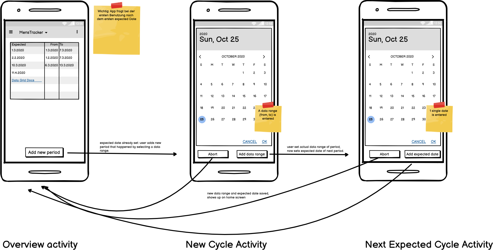

# MensTracker
Der MensTracker ermöglicht Frauen, ihre Periode digital zu tracken: In einem Kalender können sie eintragen, wann die Periode erwartet wird, wann sie effektiv begonnen und wann geendet hat. Im Gegensatz zu existierenden Trackern speichert die App die Daten lokal und [sammelt keine Daten der Nutzerin](https://media.ccc.de/v/36c3-10693-no_body_s_business_but_mine_a_dive_into_menstruation_apps).

## Features
* 3 Screens:
  * 1 Screen mit einer Liste, die alle bisher eingetragenen Daten anzeigt (Main Activity)
  * 1 Screen, um die aktuelle Periode einzutragen (von, bis) in Form einer Kalenderansicht
  * 1 Screen, um nächste erwartete Periode einzutragen (erwartet) in Form einer Kalenderansicht
* Die App ist in Kotlin geschrieben

## Bezug zum Miniprojekt
Der MensTracker ist eines der Miniprojekte im Modul "Mobile und GUI-Engineering" (HS 2020), innerhalb von 7 Wochen muss das Projekt beendet werden.
Mögliche Punkte:

* Verwendung von Kotlin statt Java (pro Teammitglied): 3 Punkte
* Daten bzw. History speichern mit Room: Persistenz / Offlinefähigkeit 1 bis 3 Punkte
* 3 Screens mit verschiedenen Funktionen: Funktionalität (pro Funktion / Screen) 1 bis 5 Punkte
* Kalender-Library-Einbindung: Integration von Drittkomponenten (Libraries) 1 bis 3 Punkte
* Platzhalter bei der Erstverwendung
* Eigenes Farbschema im Material-Design, App-Icon
* Dark-Theme: Unterschiedliche Styles (z.B. Dark-Theme) 1 bis 2 Punkte
* (Verwendung von Notifications 1 bis 2 Punkte)

## Wireframe

Ein Balsamiq-Wireframe skizziert das "Minimal Viable Product" des MensTrackers:

## Links

Kalender-Funktion (Drittkomponente einbinden):

* Verwendet: TimeSquare-Library: https://github.com/square/android-times-square
  * Tutorial für TimeSquare Library und CalendarPicker: https://www.youtube.com/watch?v=AN6UNJ-UC54
* Tutorial für eine CalendarView: https://www.youtube.com/watch?v=5WVEbU_bTeg
* Verworfene Library: https://github.com/kizitonwose/CalendarView

Persistenz / Daten speichern:

* Arten, Daten zu persistieren: 
  https://developer.android.com/training/data-storage
* App-specific files: Alle Daten z.B. in 1 Json-File speichern
  https://developer.android.com/training/data-storage/app-specific
* Database for structured Data: Room
  https://developer.android.com/training/data-storage/room
* Entscheid: Unsere Datenstruktur ist zwar klein (nur 3 Elemente pro Eintrag), aber im Alltag wird häufiger eine Datenbank verwendet, weswegen es sich lohnt, Room anzuwenden und kennen zu lernen.
